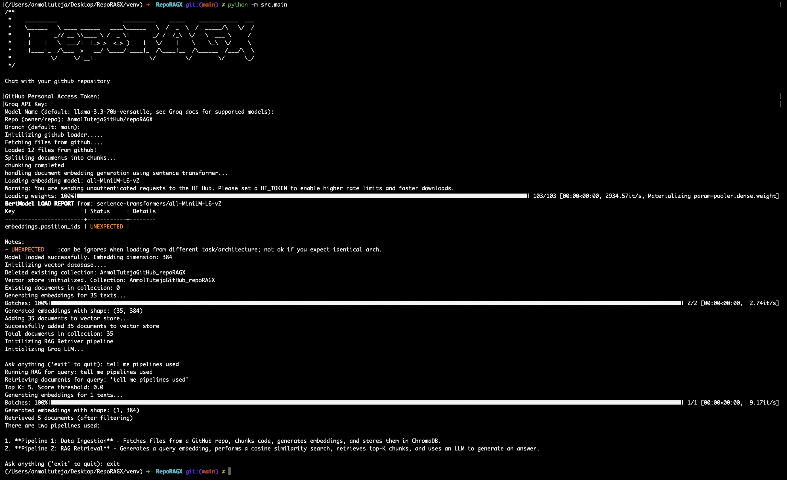

# RepoRAGX
<p align="center">
  
</p>
<p align="center">
  <a href="https://hits.sh/github.com/AnmolTutejaGitHub/RepoRAGX/">
    
  </a>
</p>

# Introduction
A CLI tool that lets you **chat with any GitHub repository** using Retrieval-Augmented Generation (RAG). Load a codebase, ask questions in natural language, and get context-aware answers.

<p align="center">
  
</p>

## How It Works

### Pipeline 1: Data Ingestion

`GitHub Repo → Load Files → Chunk Code → Generate Embeddings → Store in ChromaDB`

1. **Load** — Fetches all files from a GitHub repo using LangChain's `GithubFileLoader`, filtering out binaries, images, and folders like `node_modules/`, `.git/`, `venv/`
2. **Chunk** — Splits code using LangChain's `RecursiveCharacterTextSplitter` with language-aware splitting (supports 25+ languages)
3. **Embed** — Generates vector embeddings using Sentence Transformers' `all-MiniLM-L6-v2` model
4. **Store** — Persists embeddings in a local ChromaDB vector database with cosine similarity indexing

### Pipeline 2: RAG Retrieval

`User Query → Generate Query Embedding → Cosine Similarity Search → Retrieve Top-K Chunks → LLM Generates Answer`

1. **Embed Query** — Converts your question into vector using the same Sentence Transformers model
2. **Retrieve** — ChromaDB performs cosine similarity search and returns the top-K most relevant code chunks with file path metadata
3. **Answer** — Sends retrieved code context (with file paths) + your question to llm `llama-3.3-70b-versatile`

## Environment & Compatibility

- **Python**: 3.12
- **Environment manager**: Conda (recommended)
- **Virtual environment**: venv

## Prerequisites

You'll need two API keys:

| Key | Where to get it |
|-----|----------------|
| **GitHub Personal Access Token** | [github.com/settings/tokens](https://github.com/settings/tokens) — create a fine-grained token with `content:read` permission |
| **Groq API Key** | [console.groq.com/keys](https://console.groq.com/keys) — sign up and generate an API key |

## Installation

### 1. Clone the repository

```bash
git clone https://github.com/AnmolTutejaGitHub/RepoRAGX.git
cd RepoRAGX
```

### 2. Create and activate a virtual environment

**Using Conda (recommended):**
```bash
conda create -p venv python==3.12
conda activate venv/
```

### 3. Install dependencies

```bash
pip install -r requirements.txt
```

## Running

```bash
python -m src.main
```

You'll be prompted for:

```
GitHub Personal Access Token: ********
Groq API Key: ********
Repo (owner/repo): AnmolTutejaGitHub/RepoRAGX
Branch (default: main): main
```

Once the repo is loaded and indexed, you can start chatting:

```
Ask anything ('exit' to quit): Where is authentication implemented?
> Authentication is implemented in server/controllers/authController.js ...

Ask anything ('exit' to quit): exit
```

## Project Structure

```
RepoRAGX/
├── src/
│   ├── main.py                        # CLI entry point
│   └── rag/
│       ├── github_codebase_loader.py  # Fetches repo files from GitHub
│       ├── text_splitter.py           # Language-aware document chunking
│       ├── embedding_manager.py       # Sentence Transformer embeddings
│       ├── vector_store.py            # ChromaDB vector storage
│       ├── rag_retriever.py           # Similarity search & retrieval
│       └── groq_llm.py               # LLM integration
├── requirements.txt
├── .env.example
└── README.md
```
